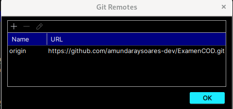
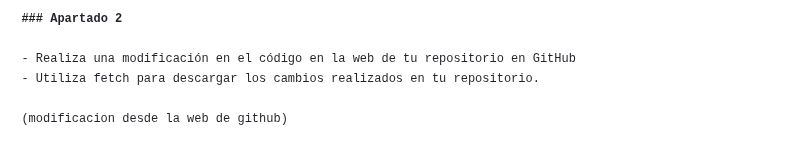
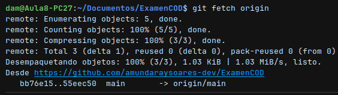
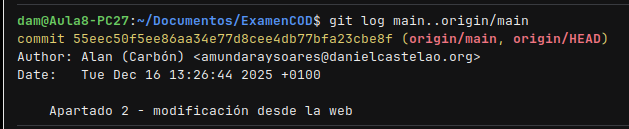
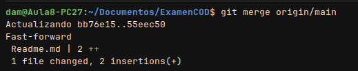
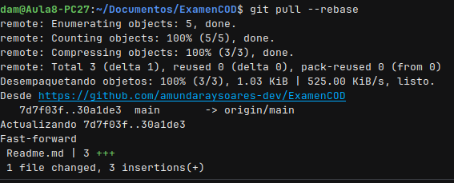

# Examen 1ª Evaluación (2ª Parte) - Control de Versiones: Alan Mundaray Soares
---

## Instrucciones
- Los commits de cada apartado deben tener el mensaje *"Apartado X - descripción del cambio realizado"*
- Entrega en la tarea de Moodle tu repositorio
- Solo se corrigen los commits que estén en el repositorio remoto

### Apartado 1

- Clona este repositorio.
- Modifica este Readme, poniendo tu nombre completo, realiza un `commit` con el mensaje *"Apartado 1"* y un `push`.

Pregunta 
- ¿Qué paso es fundamental cuando clonamos un repositorio ajeno para que podamos subir nuestros propios commits? Explícalo y utiliza capturas de pantalla.

respuesta = lo mas importante es ir al apartado de GIT > manage remote y modificar la direccion del repositorio original por la de nuestro propio repositorio, esto nos permitira hacer cambios y subirlos 

### Apartado 2

- Realiza una modificación en el código en la web de tu repositorio en GitHub
- Utiliza fetch para descargar los cambios realizados en tu repositorio.

(modificacion desde la web de github)

Pregunta
- Explica los pasos para que el código modificado en GitHub, llegue a tu rama principal local. Explícalo con capturas de pantalla.

lo primero fue desde github editar mi readme desde la web usando la herramienta de edicio, en mi caso agrege un pequeño texto

luego en mi maquina local utilice el comando "git fetch origin" para traer las modificaciones a mi maquina local sin finsionar directamente  ambas versiones 

luego de manera opcional  hago un git log main..origin/main para ver que commits se hicieron fuera, en este caso fue la modificacion en github

y por ultimo fusionamos los cambios con mi maquina local usando el git merge a mi rama main

### Apartado 3

- Realiza otro cambio desde la web de tu repositorio en GitHub.
- Utiliza pull para descargar los cambios realizados en tu repositorio.

(cambio para prueba de pull)

Pregunta
- Explica los pasos dados para que el cambio realizado en GitHub, llegue a tu rama principal local. Explícalo con capturas de pantalla.

una vez hecha la modificacion en github para poder traer esa modificacion a nuestra maquina local tendremos que hacer lo siguiente: utilizar el comando  git pull --rebase que nos permitira traer las modificaciones y cargarlas en la maquina local

